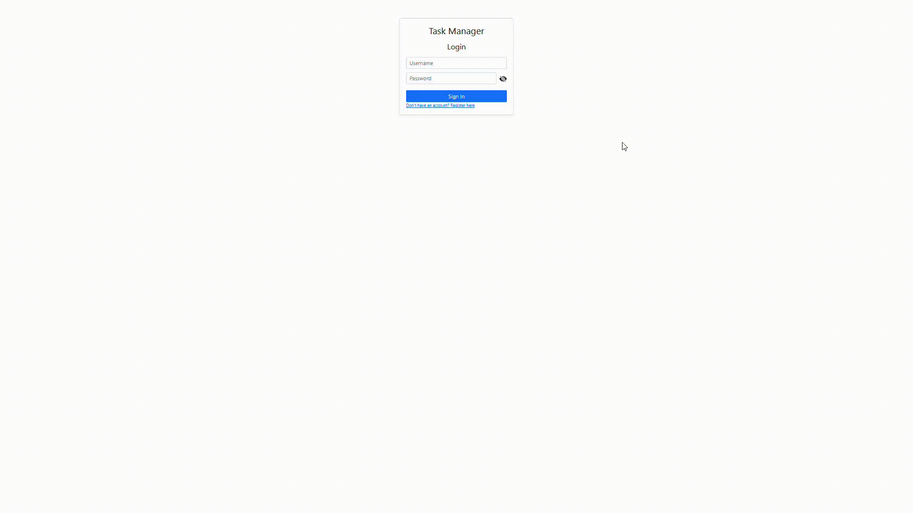
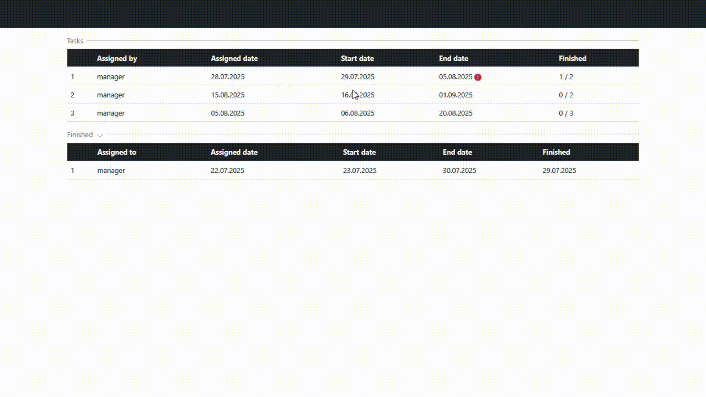
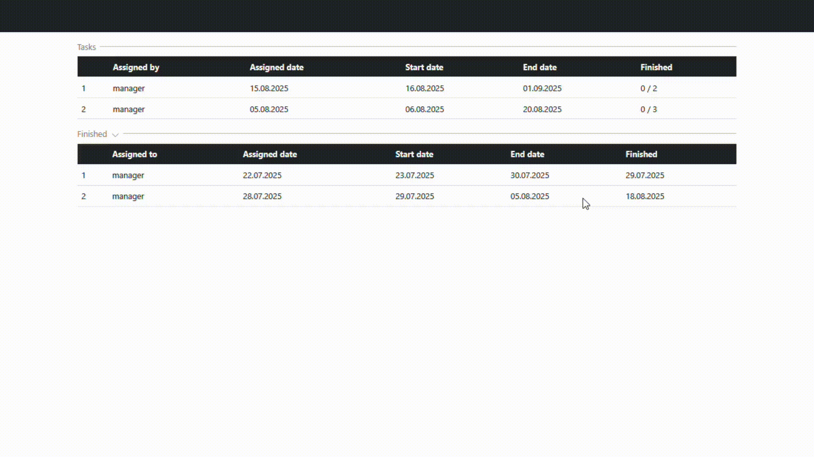
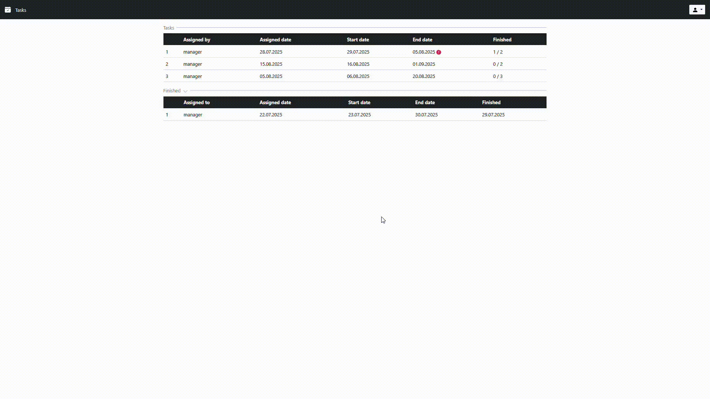
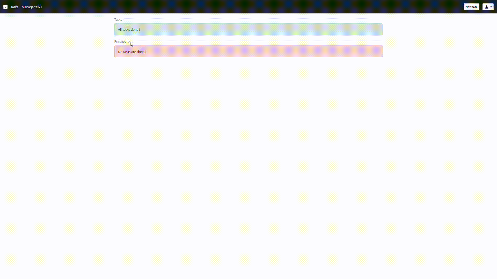
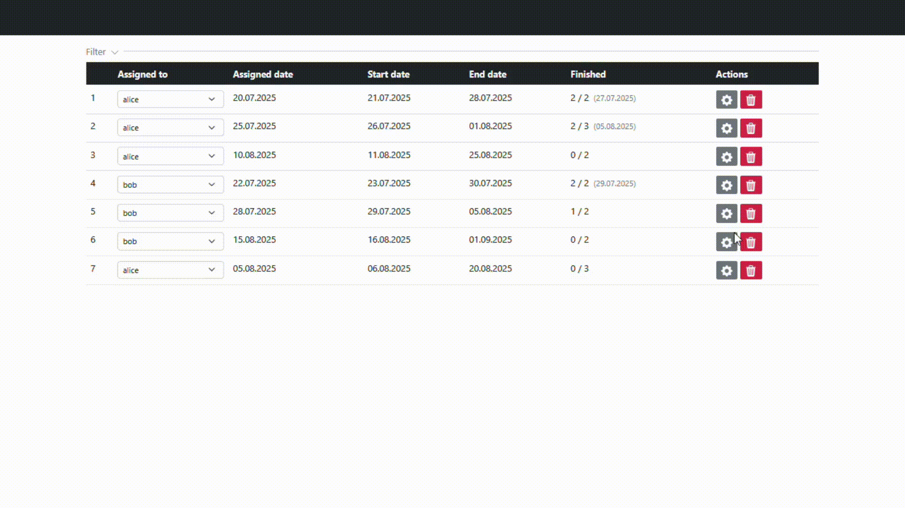

# Task Manager
Ukázková aplikace do mého **CV**, vytvořená v **ASP.NET MVC**.  
Slouží jako jednoduchý systém pro správu úkolů v týmu.  

---
## Úvod
Aplikace funguje jako systém pro zadávání a správu úkolů.  
Uživatel si může vytvořit nový účet, spravovat zadané úkoly nebo je označit jako splněné.  

Celá aplikace je spíše ukázkový projekt, který má demonstrovat mé dovednosti.  
Rozhraní aplikace je kompletně v **angličtině**.

---
## Jak aplikaci spustit

V repozitáři se nachází soubory `CREATE.sql` a ``INSERT.sql``, které vytvoří databázi, tabulky a vloží testovací data. Nebo můžete využít ``BEGIN.sql``, což je kombinace CREATE A INSERT.
V `Models\Classes\MyContext.cs` v projektu je potřeba nastavit připojení k vaší SQL databázi pomocí Entity Frameworku.  

### Testovací uživatelé
V základních datech jsou vytvořeni tři uživatelé:
- **manager** – lídr ostatních dvou účtů  
- **bob**  
- **alice**  

Všichni mají stejné velice silné heslo: **1234**.  
Heslo lze následně změnit v nastavení účtu.

---
## Funkcionalita
- Uživatel se musí nejprve **přihlásit** nebo **zaregistrovat**.  
- Uživatelé jsou buď **leadeři**, nebo mají svého **leadera**, který jim zadává úkoly.  
- Každý uživatel může mít více úkolů, přičemž jeden úkol může být zadán více uživatelům.



### Hlavní funkce
- **Domovská stránka**
  - Zobrazuje úkoly aktuálně přidělené uživateli.
  - Úkoly obsahují datum zadání, začátek a termín dokončení.
  - Tabulky lze řadit kliknutím na záhlaví sloupce.



- Každý úkol se skládá z **podúkolů** – textových popisů, které lze ručně označit za splněné.
	-  Lze rozkliknout řádek a označit podúkoly jako hotové či nesplněné
- Po dokončení všech podúkolů se úkol automaticky označí jako hotový.
- Hotové úkoly jsou viditelné v sekci **Finished**.




- **Správa účtu**
  - Každý uživatel může v pravém horním rohu části editovat svůj účet.



- **Leader**
- Může přidávat nové úkoly pomocí tlačítka **"New Task"**.


- Může spravovat všechny své úkoly v sekci **"Manage tasks"**.



- Úkoly lze filtrovat podle různých kritérií, editovat nebo mazat.



---
## Struktura projektu
### Controllers
- **Home**
  - Zobrazuje přidělené a hotové úkoly.
  - Obsahuje metodu `SubAssignmentChange`, která označuje podúkoly za hotové / nehotové.
- **Account**
  - Přihlašování, registrace, úprava a správa účtů.
- **Assignment**
  - Vytváření a editace úkolů (využité stejné view).
  - Výpis a filtrování úkolů pro leadra.
  - Mazání úkolů.

### Models
- **Classes** – vlastní třídy
  - `MyContext.cs` – připojení k databázi pomocí Entity Frameworku.
  - `PasswordDecoder.cs` – kódování a dekódování hesel.
  - `SecuredAttribute.cs` – zajišťuje, že k některým stránkám se dostanou jen přihlášení uživatelé.
  - `AdminAttribute.cs` – zajišťuje, že k určitým stránkám mají přístup jen leadeři.
- **DbClasses** – třídy pro databázové tabulky.
- **Dto** – třídy pro přenos dat.

### Components
- **Divider**
  - Jednoduchý oddělovač částí webu pro lepší přehlednost.
  - Parametry:
    - `name` – název oddělovače
    - `isExpandable` – zda je rozbalovací
    - `expandableName` – ID elementu, který se má schovávat
```html
// Jednoduchý oddělovač
<vc:divider name="Simple divider"></vc:divider>

// Rozbalovací oddělovač
<vc:divider name="Expandable divider" is-expandable="true" expandable-name="hiddenElement"></vc:divider>

<div id="hiddenElement">
  // obsah
</div>
```
- **Table**
  - Tabulka vypisující úkoly.
  - Parametry:
    - `assignments` – seznam úkolů k zobrazení
    - `tableSort` – řazení tabulky (`TableSortDto`)
    - `tableType` – typ tabulky (`Table`)
___
## Závěr

Při práci jsem si znovu osvěžil a rozšířil svoje znalosti ze střední školy ohledně ASP.NET MVC a C#. Co bych chtěl do budoucna zlepšit je moje znalost JS. Poprvé jsem lokálně stahoval a spouštěl SQL server, což doufám že v budoucnu nezabere tolik času. Hlavně bych chtěl zlepšit můj time-management skill, protože jsem na projektu strávil mnohem více času než jsem očekával a kolik bych si přál.
